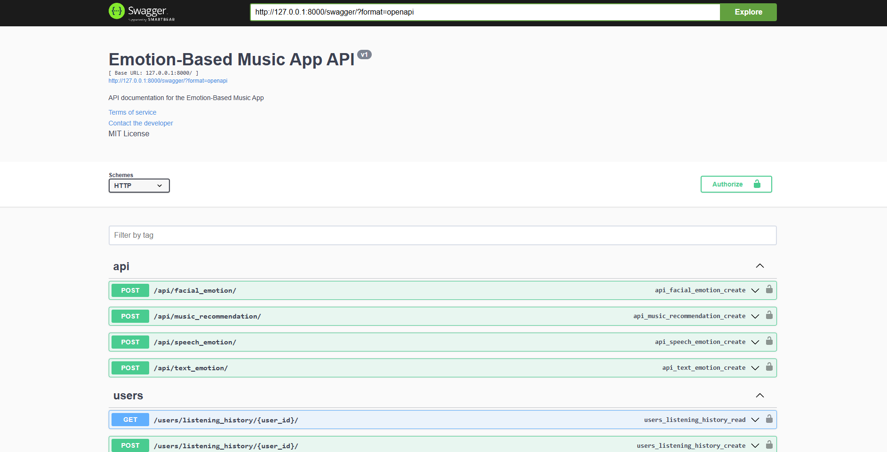
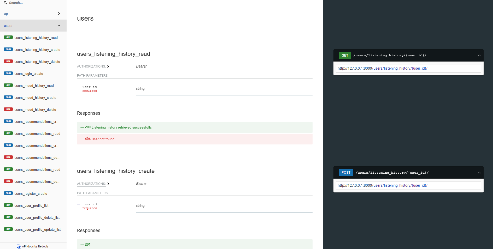

# Moodify - Emotion-Based Music App Backend

This repository contains the backend for the Emotion-Based Music App named **Moodify**, built using Django and MongoDB. The backend allows users to manage their mood and listening history and receive personalized music recommendations based on their emotional state.

## Table of Contents

- [Getting Started](#getting-started)
- [File Structure](#file-structure)
- [API Endpoints](#api-endpoints)
  - [User Endpoints](#user-endpoints)
  - [Emotion Detection Endpoints](#emotion-detection-endpoints)
  - [Admin Interface Endpoints](#admin-interface-endpoints)
- [Testing the API](#testing-the-api)
- [Using Postman](#using-postman)
- [API Documentation](#api-documentation)
  - [Swagger UI](#swagger-ui)
  - [Redoc](#redoc)
- [Using the Admin Panel](#using-the-admin-panel)
- [Contributing](#contributing)
- [License](#license)

## Getting Started

### Prerequisites

Before running the backend, ensure you have the following installed:

- Python 3.8 or later
- Pip (Python package installer)
- MongoDB

### Installation

1. **Clone the Repository**:
   ```bash
   git clone https://github.com/hoangsonww/Moodify-Emotion-Based-Music-App.git
   cd Moodify-Emotion-Based-Music-App/backend
   ```

2. **Create a Virtual Environment**:
   ```bash
   python -m venv venv
   ```

3. **Activate the Virtual Environment**:
   - **Windows**:
     ```bash
     .\venv\Scripts\activate
     ```
   - **Mac**:
     ```bash
     source venv/bin/activate
     ```

4. **Install Dependencies**:
   ```bash
   pip install -r requirements.txt
   ```

5. **Run MongoDB**: Ensure your MongoDB service is running. You can start MongoDB with the following command:
   ```bash
   mongod
   ```

6. **Run the Django Server**:
   ```bash
   python manage.py runserver
   ```

The server should now be running at `http://127.0.0.1:8000/`.

## File Structure

Here is the detailed file structure of the backend:

```
Moodify-Emotion-Based-Music-App/
├── backend/
│   ├── manage.py                  # Django's command-line utility for administrative tasks
│   ├── requirements.txt            # Project dependencies
│   ├── db.sqlite3                  # SQLite database file (if used)
│   ├── backend/
│   │   ├── __init__.py            # Empty file to mark the directory as a Python package
│   │   ├── settings.py             # Django settings for the project
│   │   ├── urls.py                 # URL declarations for the project
│   │   ├── wsgi.py                 # WSGI application for deployment
│   │   ├── users/
│   │   │   ├── __init__.py         # Empty file to mark the directory as a Python package
│   │   │   ├── models.py           # MongoDB models for user profiles
│   │   │   ├── views.py            # API views for handling user-related requests
│   │   │   └── urls.py             # URL declarations for user-related endpoints
│   │   └── api/
│   │       ├── __init__.py         # Empty file to mark the directory as a Python package
│   │       ├── views.py            # API views for handling emotion-related requests
│   │       └── urls.py             # URL declarations for emotion-related endpoints
└── README.md                       # This README file
```

## API Endpoints

### User Endpoints

| HTTP Method | Endpoint                                                         | Description                                     |
|-------------|------------------------------------------------------------------|-------------------------------------------------|
| `POST`      | `/users/register/`                                               | Register a new user                             |
| `POST`      | `/users/login/`                                                  | Login a user and obtain a JWT token             |
| `GET`       | `/users/user/profile/`                                           | Retrieve the authenticated user's profile       |
| `PUT`       | `/users/user/profile/update/`                                    | Update the authenticated user's profile         |
| `DELETE`    | `/users/user/profile/delete/`                                    | Delete the authenticated user's profile         |
| `POST`      | `/users/recommendations/`                                        | Save recommendations for a user                 |
| `GET`       | `/users/recommendations/<str:username>/`                         | Retrieve recommendations for a user by username |
| `DELETE`    | `/users/recommendations/<str:username>/<str:recommendation_id>/` | Delete a specific recommendation for a user     |
| `DELETE`    | `/users/recommendations/<str:username>/`                         | Delete all recommendations for a user           |
| `POST`      | `/users/mood_history/<str:user_id>/`                             | Add a mood to the user's mood history           |
| `GET`       | `/users/mood_history/<str:user_id>/`                             | Retrieve mood history for a user                |
| `DELETE`    | `/users/mood_history/<str:user_id>/`                             | Delete a specific mood from the user's history  |
| `POST`      | `/users/listening_history/<str:user_id>/`                        | Add a track to the user's listening history     |
| `GET`       | `/users/listening_history/<str:user_id>/`                        | Retrieve listening history for a user           |
| `DELETE`    | `/users/listening_history/<str:user_id>/`                        | Delete a specific track from the user's history |
| `POST`      | `/users/user_recommendations/<str:user_id>/`                     | Save a user's recommendations                   |
| `GET`       | `/users/user_recommendations/<str:user_id>/`                     | Retrieve a user's recommendations               |
| `DELETE`    | `/users/user_recommendations/<str:user_id>/`                     | Delete all recommendations for a user           |

### Emotion Detection Endpoints

| HTTP Method | Endpoint                     | Description                                |
|-------------|------------------------------|--------------------------------------------|
| `POST`      | `/api/text_emotion/`         | Analyze text for emotional content         |
| `POST`      | `/api/speech_emotion/`       | Analyze speech for emotional content       |
| `POST`      | `/api/facial_emotion/`       | Analyze facial expressions for emotions    |
| `POST`      | `/api/music_recommendation/` | Get music recommendations based on emotion |

### Admin Interface Endpoints

| HTTP Method | Endpoint                     | Description                                  |
|-------------|------------------------------|----------------------------------------------|
| `GET`       | `/admin/`                    | Access the Django Admin interface            |


## Testing the API

You can use tools like Postman or CURL to test the API endpoints. **Make sure to register a user first to obtain the Bearer JWT token. This token will be required for accessing most of the other endpoints.**

### Obtaining the Bearer JWT Token

1. **Register a User**:
   - **Method:** POST
   - **URL:** `http://127.0.0.1:8000/users/register/`
   - **Body (JSON)**:
     ```json
     {
         "username": "testuser",
         "password": "password123",
         "email": "example@email.com"
     }
     ```
   - **Response**: If successful, you will receive a response containing the user details and a token.
   
2. **Login to Obtain JWT Token**:
   - **Method:** POST
   - **URL:** `http://127.0.0.1:8000/users/login/`
   - **Body (JSON)**:
     ```json
     {
         "username": "testuser",
         "password": "password123"
     }
     ```
   - **Response**: You will receive a response with a Bearer JWT token:
     ```json
     {
         "token": "your_jwt_token_here"
     }
     ```

### Using Postman

1. **Open Postman**: Download and install Postman from [here](https://www.postman.com/downloads/).

2. **Set Up Your Requests**: Use the following configurations for each endpoint, ensuring to include the Bearer token in the authorization header for protected endpoints:

   #### User Endpoints

   - **Register User**
     - **Method:** POST
     - **URL:** `http://127.0.0.1:8000/users/register/`
     - **Body (JSON)**:
       ```json
       {
           "username": "testuser",
           "password": "password123"
       }
       ```

   - **Login User**
     - **Method:** POST
     - **URL:** `http://127.0.0.1:8000/users/login/`
     - **Body (JSON)**:
       ```json
       {
           "username": "testuser",
           "password": "password123"
       }
       ```

   - **Get User Profile**
     - **Method:** GET
     - **URL:** `http://127.0.0.1:8000/users/user/profile/`
     - **Headers**:
       - `Authorization`: `Bearer your_jwt_token_here`

   - **Update User Profile**
     - **Method:** POST
     - **URL:** `http://127.0.0.1:8000/users/user/profile/update/`
     - **Headers**:
       - `Authorization`: `Bearer your_jwt_token_here`
     - **Body (JSON)**:
       ```json
       {
           "new_username": "newuser"
       }
       ```

   - **Delete User Profile**
     - **Method:** DELETE
     - **URL:** `http://127.0.0.1:8000/users/user/profile/delete/`
     - **Headers**:
       - `Authorization`: `Bearer your_jwt_token_here`

   - **Add Recommendations**
     - **Method:** POST
     - **URL:** `http://127.0.0.1:8000/users/recommendations/`
     - **Headers**:
       - `Authorization`: `Bearer your_jwt_token_here

`
     - **Body (JSON)**:
       ```json
       {
           "recommendation": "Song Title"
       }
       ```

   #### Emotion Detection Endpoints

   - **Text Emotion Analysis**
     - **Method:** POST
     - **URL:** `http://127.0.0.1:8000/api/text_emotion/`
     - **Body (JSON)**:
       ```json
       {
           "text": "I am feeling great today!"
       }
       ```

   - **Speech Emotion Analysis**
     - **Method:** POST
     - **URL:** `http://127.0.0.1:8000/api/speech_emotion/`
     - **Body (JSON)**:
       ```json
       {
           "audio_file": "path_to_audio_file"
       }
       ```

   - **Facial Emotion Analysis**
     - **Method:** POST
     - **URL:** `http://127.0.0.1:8000/api/facial_emotion/`
     - **Body (JSON)**:
       ```json
       {
           "image_file": "path_to_image_file"
       }
       ```

   - **Music Recommendation Based on Emotion**
     - **Method:** POST
     - **URL:** `http://127.0.0.1:8000/api/music_recommendation/`
     - **Body (JSON)**:
       ```json
       {
           "emotion": "happy"
       }
       ```

3. **Check Responses**: Monitor the response status and body to ensure correct functionality.

## API Documentation

### Swagger UI

The API documentation is available in the Swagger UI format. You can access the Swagger UI by navigating to `http://127.0.0.1:8000/swagger/`.

You should see a page like this:



### Redoc

The API documentation is also available in the Redoc format. You can access the Redoc documentation by navigating to `http://127.0.0.1:8000/redoc/`.

You should see a page like this:



## Using the Admin Panel

Django provides an admin panel for managing the database and user profiles. You can access the admin panel by following these steps:

1. **Create a Superuser**:
   ```bash
   python manage.py createsuperuser
   ```
    Follow the prompts to create a superuser account.

2. **Run the Django Server**:
   ```bash
   python manage.py runserver
   ```

3. **Access the Admin Panel**: Open your browser and navigate to `http://127.0.0.1:8000/admin/`. Log in with the superuser credentials you created. Yours should look like this:

   

4. **Manage User Profiles**: You can view, add, update, and delete user profiles from the admin panel.

## Contributing

Contributions are welcome! Please fork the repository and submit a pull request for any improvements or fixes.

## License

This project is licensed under the MIT License - see the [LICENSE](LICENSE) file for details.

---

Happy coding! 🎵🎶
