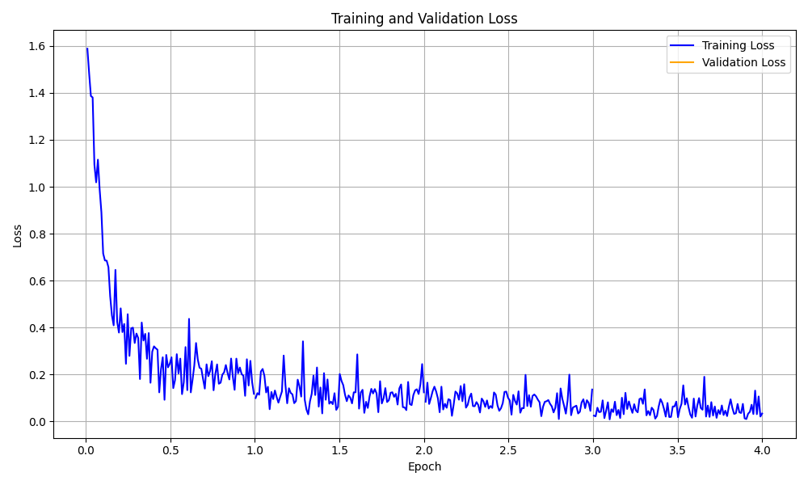
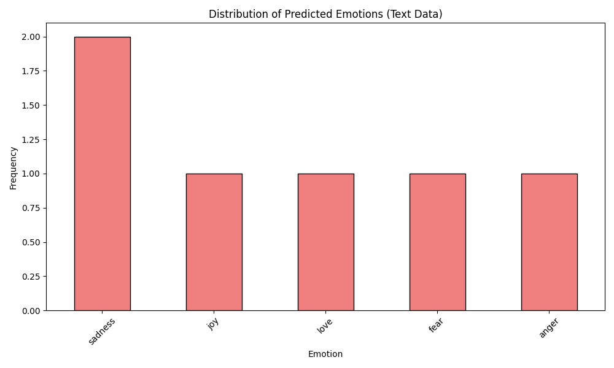
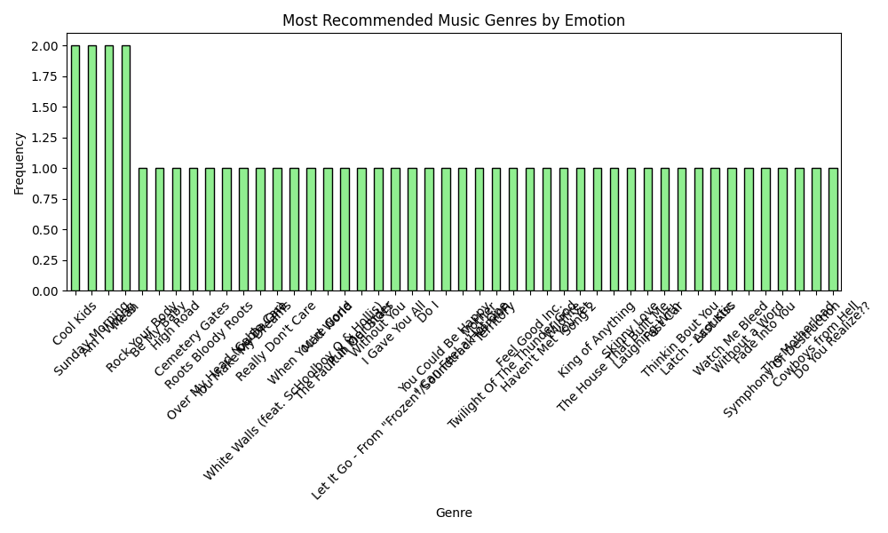

# Data Analytics and Visualizations for Emotion-Based Music App

This `data_analytics` directory contains scripts for performing data analysis and visualizations based on the emotion detection model's training, predictions, and recommendations. The visualizations provide insights into the data distribution, model training process, prediction accuracy, and music recommendations.

## Table of Contents

- [Directory Structure](#directory-structure)
- [Installation](#installation)
- [How to Use](#how-to-use)
- [Spark/Hadoop](#sparkhadoop)
- [Analytics Scripts](#analytics-scripts)
  - [1. emotion_distribution.py](#1-emotion_distributionpy)
  - [2. training_visualization.py](#2-training_visualizationpy)
  - [3. predictions_analysis.py](#3-predictions_analysispy)
  - [4. recommendation_analysis.py](#4-recommendation_analysispy)
- [Visualizations](#visualizations)

## Directory Structure

The `data_analytics` directory has the following structure:

```
data_analytics
│
├── emotion_distribution.py          # Script for visualizing emotion distribution in training data
├── training_visualization.py        # Script for visualizing training and validation metrics
├── predictions_analysis.py          # Script for analyzing and visualizing model predictions
├── recommendation_analysis.py       # Script for visualizing music recommendations based on emotions
├── main.py                          # Script to execute all analytics scripts sequentially
├── spark-hadoop/                    # Directory containing Spark and Hadoop integration scripts
├── ├── hadoop_config.py             # Hadoop configuration settings
│   └── spark_hadoop_integration.py  # Script for data preprocessing using Spark and Hadoop
└── visualizations/                  # Directory to store generated visualizations
    ├── emotion_distribution.png
    ├── loss_curve.png
    ├── accuracy_curve.png
    ├── text_emotion_predictions.png
    └── music_recommendation_trends.png
```

## Installation

Before running the analytics scripts, make sure you have installed all necessary Python packages. You can install them using:

```bash
pip install pandas matplotlib
```

Ensure your environment is activated and all dependencies for the emotion-based music app are correctly set up.

## How to Use

To run all the analytics scripts together, execute the `main.py` script:

```bash
python data_analytics/main.py
```

This will generate all the visualizations and save them in the `visualizations` folder.

Alternatively, you can run each script independently for specific visualizations:
```bash
python data_analytics/emotion_distribution.py
python data_analytics/training_visualization.py
python data_analytics/predictions_analysis.py
python data_analytics/recommendation_analysis.py
```

## Spark/Hadoop

The `data_analytics` directory contains scripts for data preprocessing, analysis, and visualization of the training and test datasets. These scripts must be run before training the model to understand the data distribution, model performance, and music recommendation trends.

```bash
python data_analytics/spark-hadoop/spark_hadoop_integration.py
```

This script performs data preprocessing using Spark and Hadoop to clean and transform the dataset for training the emotion detection model. It also generates visualizations to understand the data distribution and trends.

## Analytics Scripts

### 1. `emotion_distribution.py`

This script analyzes and visualizes the distribution of emotions in the training dataset. It provides insights into how the emotions are spread across the dataset.

**Visualization Output:** `emotion_distribution.png`


### 2. `training_visualization.py`

This script visualizes the model's training and validation metrics, such as loss and accuracy, across all epochs. It helps in understanding the training performance of the model.

**Visualization Outputs:** `loss_curve.png`
  

### 3. `predictions_analysis.py`

This script analyzes and visualizes the model's predictions on the test dataset. It compares the predicted emotions against the true emotions to provide insights into the model's performance.

**Visualization Output:** `text_emotion_predictions.png`


### 4. `recommendation_analysis.py`

This script visualizes the trends in music recommendations based on the predicted emotions. It provides insights into which genres or tracks are frequently recommended for different emotions.

**Visualization Output:** `music_recommendation_trends.png`


## Visualizations

All generated visualizations are saved in the `visualizations` folder. Here is a description of each visualization:

### 1. Emotion Distribution
This chart shows the distribution of different emotions in the training dataset. It helps understand whether the dataset is balanced or skewed toward specific emotions.

### 2. Training and Validation Loss
The loss curve shows how the training and validation loss changes over each epoch. It helps in identifying overfitting or underfitting.

### 3. Training and Validation Accuracy
The accuracy curve shows how the model's accuracy improves over time, indicating how well the model is learning.

### 4. Text Emotion Predictions
This visualization shows the comparison between the true and predicted emotions for the test dataset, giving an idea of the model's accuracy and performance.

### 5. Music Recommendation Trends
This visualization displays the most common music recommendations for different emotions, helping to identify patterns in the recommendation system.

## Notes

- Make sure to run the `train_text_emotion.py` script from the `ai_ml` directory to generate the `training_log.csv` file required for `training_visualization.py`.
- The generated visualizations can be used to better understand model performance, dataset characteristics, and the relationship between emotions and music recommendations.

## Contact

If you have any questions or need further assistance, feel free to reach out to me at [hoangson091104@gmail.com](mailto:hoangson091104@gmail.com).

---

**Happy Analyzing! 🎶**
